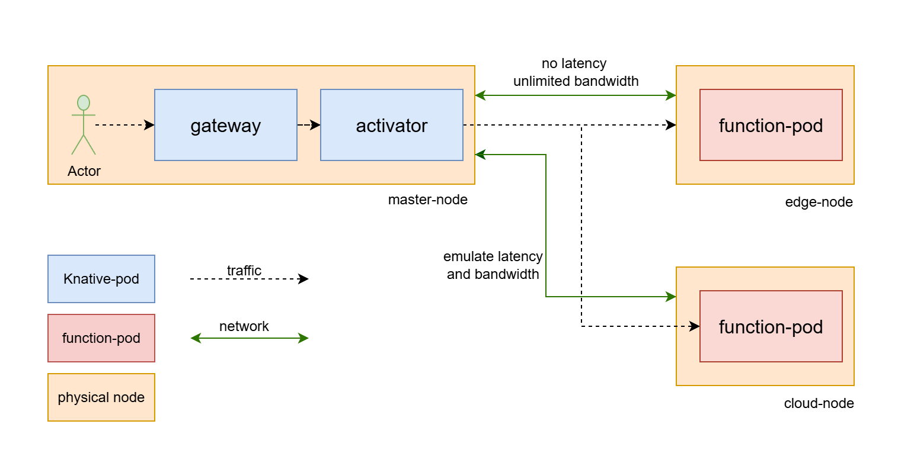

# serverless-measurement-doc
Documentation for Serverless Setup and Measurement

## Table of contents

- [Testbed design](#testbed-design)
- [Setting up a product ready Kubernetes cluster](#setting-up-a-product-ready-kubernetes-cluster)
- [Setting up a serverless cluster](#setting-up-a-serverless-cluster)
  - [Installing Knative Serving using YAML files](#installing-knative-serving-using-yaml-files)
    - [Install the Knative Serving component](#1-install-the-knative-serving-component)
    - [Install a networking layer](#2-install-a-networking-layer)
    - [Verify the installation](#3-verify-the-installation)
  - [Advance configuration](#advance-configuration)
    - [Kourier Gateway](#kourier-gateway)
    - [Activator](#activator)
    - [Check your configuration](#check-your-configuration)
- [Network configuration](#network-configuration)
- [Setting up Prometheus for measuring](#setting-up-prometheus-for-measuring)
  - [Install Prometheus](#install-prometheus)
  - [Running Prometheus](#running-prometheus)

## Testbed design



In this testbed, we build up three nodes which is `master-node`, and two worker nodes (`cloud-node` and `edge-node`). `mater-node` will be the `control-plane` for `Kubernetes` cluster. It will generate requests and the measurement will be run right there. We will emulate latency and bandwidth between `master-node` and two other worker nodes. Functions will be served in two worker nodes and we will run `Prometheus` server in these nodes for measurement.

## Setting up a product ready Kubernetes cluster
You can follow [this guild](https://github.com/kenphunggg/kubespray.git) to build your own K8s cluster using `Kubespray`

## Setting up a serverless cluster
In this testbed, we're using [Knative](https://knative.dev/docs/) for building a `Serverless cluster`

### Installing Knative Serving using YAML files

#### 1. Install the Knative Serving component

To install the Knative Serving component:

```shell
# Install the required custom resources by running the command
kubectl apply -f https://github.com/knative/serving/releases/download/knative-v1.18.1/serving-crds.yaml

# Install the core components of Knative Serving by running the command
kubectl apply -f https://github.com/knative/serving/releases/download/knative-v1.18.1/serving-core.yaml
```

#### 2. Install a networking layer

```shell
# Install the Knative Kourier controller by running the command
kubectl apply -f https://github.com/knative/net-kourier/releases/download/knative-v1.18.0/kourier.yaml

# Configure Knative Serving to use Kourier by default by running the command:
kubectl patch configmap/config-network \
  --namespace knative-serving \
  --type merge \
  --patch '{"data":{"ingress-class":"kourier.ingress.networking.knative.dev"}}'
```

Fetch the External IP address or CNAME by running the command:

```shell
kubectl --namespace kourier-system get service kourier
```

#### 3. Verify the installation

Monitor the Knative components until all of the components show a STATUS of Running or Completed. You can do this by running the following command and inspecting the output:

```shell
kubectl get pods -n knative-serving
```

Example output:

```shell
NAME                                      READY   STATUS    RESTARTS   AGE
3scale-kourier-control-54cc54cc58-mmdgq   1/1     Running   0          81s
activator-67656dcbbb-8mftq                1/1     Running   0          97s
autoscaler-df6856b64-5h4lc                1/1     Running   0          97s
controller-788796f49d-4x6pm               1/1     Running   0          97s
webhook-859796bc7-8n5g2                   1/1     Running   0          96s
```

### Advance configuration

#### Kourier Gateway

```shell
# replicate 3scale-gateway pod to 3 replicas
kubectl -n kourier-system patch deploy 3scale-kourier-gateway --patch '{"spec":{"replicas":1}}'
kubectl -n kourier-system patch deploy 3scale-kourier-gateway --patch '{"spec":{"template":{"spec":{"affinity":{"nodeAffinity":{"requiredDuringSchedulingIgnoredDuringExecution":{"nodeSelectorTerms":[{"matchExpressions":[{"key":"kubernetes.io/hostname","operator":"In","values":["master-node"]}]}]}}}}}}}'

# use local gateway for every request
kubectl -n kourier-system patch service kourier --patch '{"spec":{"internalTrafficPolicy":"Local","externalTrafficPolicy":"Local"}}'
kubectl -n kourier-system patch service kourier-internal --patch '{"spec":{"internalTrafficPolicy":"Local"}}'
```

#### Activator

```shell
# replicate activator pod to 3 replicas
kubectl -n knative-serving patch deploy activator --patch '{"spec":{"replicas":1}}'
kubectl -n knative-serving patch deploy activator --patch '{"spec":{"template":{"spec":{"affinity":{"nodeAffinity":{"requiredDuringSchedulingIgnoredDuringExecution":{"nodeSelectorTerms":[{"matchExpressions":[{"key":"kubernetes.io/hostname","operator":"In","values":["master-node"]}]}]}}}}}}}'
```

#### Config-map

```shell
kubectl patch configmap config-features \
  -n knative-serving \
  --type merge \
  -p '{"data":{"kubernetes.podspec-nodeselector":"enabled"}}'

kubectl patch configmap config-features \
  -n knative-serving \
  --type merge \
  -p '{"data":{"kubernetes.podspec-fieldref":"enabled"}}' 

```

#### Systemd-resolved

It is recommended to configure `/etc/systemd/resolved.conf` to get access to pods without a `curl_pod`. Look at the field `Domains` and adjust it like below

```bash
Domains=default.svc.cluster.local svc.cluster.local cluster.local
```

Then you can apply changes

```bash
systemctl restart systemd-resolved
```

#### Check your configuration

```shell
thai@master-node ~/ken/serverless-measurement-doc
 $ kubectl -n knative-serving get pod -o wide | grep activator
activator-6f5448b646-9sfzp                1/1     Running     0          4m15s   10.233.113.141   master-node   <none>           <none>
```

```shell
thai@master-node ~/ken/serverless-measurement-doc
 $ kubectl -n kourier-system get pod -o wide
NAME                                      READY   STATUS    RESTARTS   AGE     IP               NODE          NOMINATED NODE   READINESS GATES
3scale-kourier-gateway-5886fc6dbd-tcf8v   1/1     Running   0          8m31s   10.233.113.139   master-node   <none>           <none>
```

> [!IMPORTANT]
> Make sure your cluster have exactly one activator and one gateway each node

## Network configuration

In this work, we use [traffic-control](https://github.com/kenphunggg/traffic-control.git) for emulating latency and bandwidth between nodes.

## Setting up Prometheus for measuring

### Install Prometheus

Precompiled binaries for released versions are available in the [download](https://prometheus.io/download/) section on [Prometheus](https://prometheus.io/). Using the latest production release binary is the recommended way of installing Prometheus. See the [Installing](https://prometheus.io/docs/prometheus/latest/installation/) chapter in the documentation for all the details.

Download the latest release of Prometheus for your platform

```shell
# Download Prometheus monitoring system and time series database.
wget https://github.com/prometheus/prometheus/releases/download/v3.5.0/prometheus-3.5.0.linux-amd64.tar.gz

# Download Prometheus Alertmanager
wget https://github.com/prometheus/alertmanager/releases/download/v0.28.1/alertmanager-0.28.1.linux-amd64.tar.gz

# Download Blackbox prober exporter
wget https://github.com/prometheus/blackbox_exporter/releases/download/v0.27.0/blackbox_exporter-0.27.0.linux-amd64.tar.gz

# Download Exporter for Consul metrics
wget https://github.com/prometheus/consul_exporter/releases/download/v0.13.0/consul_exporter-0.13.0.linux-amd64.tar.gz

# Download graphite_exporter
wget https://github.com/prometheus/graphite_exporter/releases/download/v0.16.0/graphite_exporter-0.16.0.linux-amd64.tar.gz

# Download memcached_exporter
wget https://github.com/prometheus/memcached_exporter/releases/download/v0.15.3/memcached_exporter-0.15.3.linux-amd64.tar.gz

# Download mysqld_exporter
wget https://github.com/prometheus/mysqld_exporter/releases/download/v0.17.2/mysqld_exporter-0.17.2.linux-amd64.tar.gz

# Download node_exporter
wget https://github.com/prometheus/node_exporter/releases/download/v1.9.1/node_exporter-1.9.1.linux-amd64.tar.gz

# Download promlens
wget https://github.com/prometheus/promlens/releases/download/v0.3.0/promlens-0.3.0.linux-amd64.tar.gz

# Download push gateway
wget https://github.com/prometheus/pushgateway/releases/download/v1.11.1/pushgateway-1.11.1.linux-amd64.tar.gz

# statsd exporter
wget https://github.com/prometheus/statsd_exporter/releases/download/v0.28.0/statsd_exporter-0.28.0.linux-amd64.tar.gz
```

Then extract it 

```shell
tar xvfz prometheus-*.tar.gz
tar xvf node_exporter-1.9.1.linux-amd64.tar.gz
sudo mv prometheus-3.5.0.linux-amd64/promtool /usr/local/bin/
sudo mv prometheus-3.5.0.linux-amd64/prometheus /usr/local/bin/
sudo mv node_exporter-1.9.1.linux-amd64/node_exporter /usr/local/bin
```

### Setting up Prometheus

The Prometheus configuration is written in the YAML file, its default configuration is in the folder `prometheus-3.5.0.linux-amd64` with the name `prometheus.yml` we unzipped it above, let's take a look at it.

```shell
cat prometheus-3.5.0.linux-amd64/prometheus.yml
```

Modify `prometheus.yml` in master-node that can collect metrics from worker-nodes that host node_exporters. Here is my example config. 

```yml
# my global config
global:
  scrape_interval: 2s # Set the scrape interval to every 2 seconds. Default is every 1 minute.
  evaluation_interval: 15s # Evaluate rules every 15 seconds. The default is every 1 minute.
  # scrape_timeout is set to the global default (10s).

# Alertmanager configuration
alerting:
  alertmanagers:
    - static_configs:
        - targets:
          # - alertmanager:9093

# Load rules once and periodically evaluate them according to the global 'evaluation_interval'.
rule_files:
  # - "first_rules.yml"
  # - "second_rules.yml"

# A scrape configuration containing exactly one endpoint to scrape:
# Here it's Prometheus itself.
scrape_configs:
  # The job name is added as a label `job=<job_name>` to any timeseries scraped from this config.
  - job_name: "prometheus"

    # metrics_path defaults to '/metrics'
    # scheme defaults to 'http'.

    static_configs:
      - targets: ["localhost:9090"]
       # The label name is added as a label `label_name=<label_value>` to any timeseries scraped from this config.
        labels:
          app: "prometheus"
  - job_name: "node_exporter"
    static_configs:
      - targets: ["192.168.17.130:9100", "192.168.17.131:9100"]
```

For more security, we should create user and group to manage `Prometheus`

```bash
sudo useradd -rs /bin/false prometheus

sudo chown prometheus:prometheus /usr/local/bin/prometheus
```

We should move the configuration file to a more appropriate folder.

```shell
sudo mkdir -p /etc/prometheus
sudo mv prometheus-3.5.0.linux-amd64/prometheus.yml /etc/prometheus

# Folder to store Prometheus data
sudo mkdir -p data/prometheus

sudo chown -R prometheus:prometheus data/prometheus /etc/prometheus/*
```

Now, we will create service to run `Prometheus`

```bash
cd /lib/systemd/system
sudo nano prometheus.service
```

Edit contents in `prometheus.service` like this 

```
[Unit]
Description=Prometheus
Wants=network-online.target
After=network-online.target

[Service]
Type=simple
User=prometheus
Group=prometheus
ExecStart=/usr/local/bin/prometheus \
 --config.file=/etc/prometheus/prometheus.yml \
 --storage.tsdb.path=/data/prometheus \
 --web.console.templates=/etc/prometheus/consoles \
 --web.console.libraries=/etc/prometheus/console_libraries \
 --web.listen-address=0.0.0.0:9090 \
 --web.enable-admin-api

Restart=always

[Install]
WantedBy=multi-user.target
```

#### Setting up node exporter

First, you should create an user for `node_exporter`

```bash
sudo useradd -rs /bin/false node_exporter
sudo chown node_exporter:node_exporter /usr/local/bin/node_exporter
```

Then, create a service for `node_exporter`

```bash
cd /lib/systemd/system
sudo nano node_exporter.service
```

Copy this content to `node_exporter`

```
[Unit]
Description=Node Exporter
After=network-online.target

[Service]
User=node_exporter
Group=node_exporter
Type=simple
ExecStart=/usr/local/bin/node_exporter

[Install]
WantedBy=multi-user.target
```

Run the service

```bash
sudo systemctl daemon-reload
sudo systemctl start node_exporter

sudo systemctl status node_exporter
```

## Measurement

Follow our our guild for measuring [here](https://github.com/kenphunggg/serverless-measurement.git)


